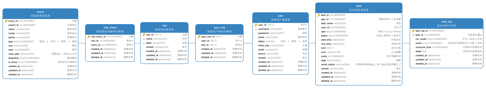

# 简介



[数据库设计](./sql/sf-admin.md)

# 使用

创建数据库 sf-admin，使用 sql/midway-admin.sql 初始化数据库

配置 .env 文件，配置参数参考 .env.local

启动

```
npm install

npm run dev
```

更新数据库 MD 文档

```
npm install -g db2md-cli

db2md g -u root -p 3306 -pwd root -h 127.0.0.1 sf_admin
```
